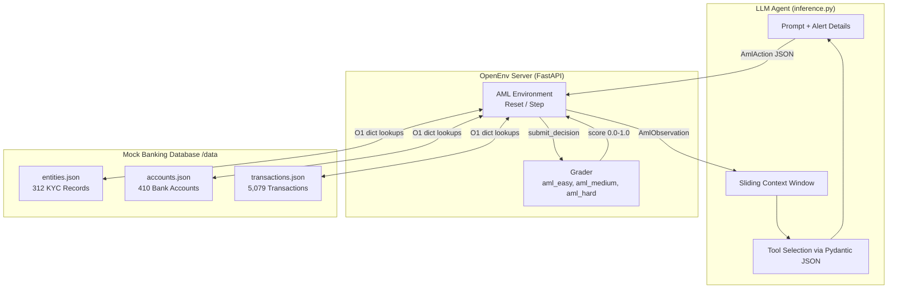
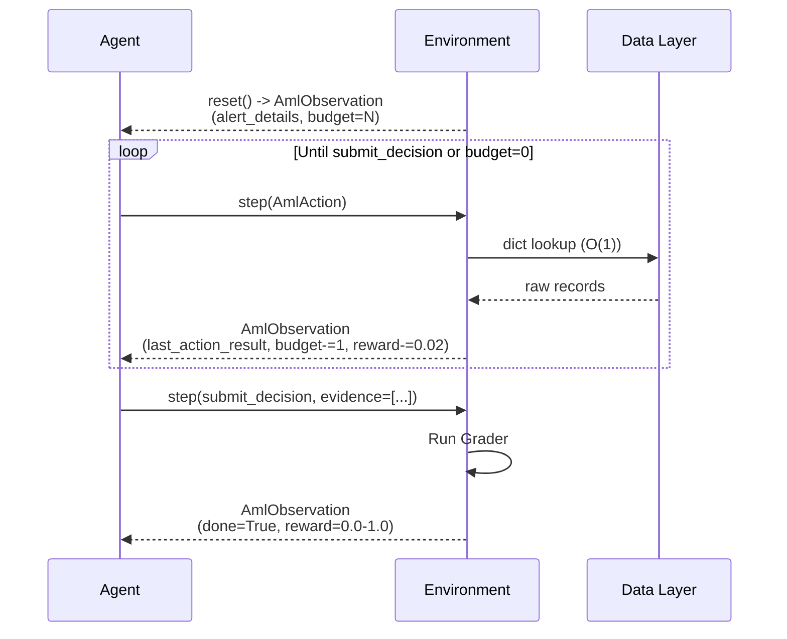
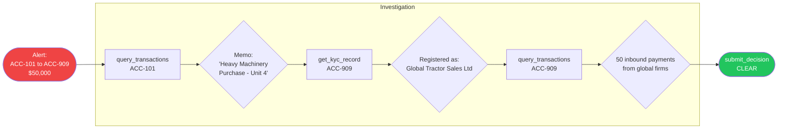
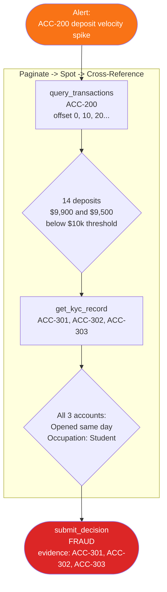
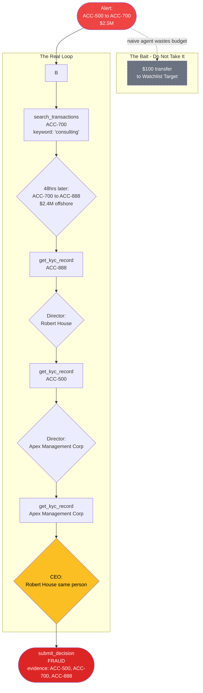

<div align="center">

# 🕵️ AML Investigator OpenEnv RL Environment

**A financial crime investigation environment for training and evaluating LLM agents**

[](https://github.com/openenv)
[](https://fastapi.tiangolo.com)
[](https://docs.pydantic.dev)
[](https://www.docker.com)
[](https://huggingface.co/spaces)

</div>

---

## What Is This?

Most RL benchmarks for language models test knowledge retrieval or reasoning in isolation. This environment tests something harder and more practical: **can an LLM agent act as a financial investigator?**

The agent is given a banking system alert and a budget of API calls. It must use tools to query transaction ledgers, search memo fields, pull KYC records, and finally submit a verdict — `FRAUD` or `CLEAR` — with evidence. The agent is rewarded for correctness and efficiency; it is penalized for every wasted call.

What makes this environment non-trivial:

- **The haystack is real noise.** 5,000+ transactions of legitimate payroll, utility bills, and vendor invoices surround every fraud signal.
- **Pagination is mandatory.** Corporate accounts hold 150–500 transactions. Dumping them all into context causes an OOM failure. The agent must learn to search and paginate strategically.
- **False flags are everywhere.** The hard task contains a $100 transfer to an entity with a watchlist name — designed specifically to bait the agent into wasting its budget.
- **KYC cross-referencing.** The hardest task cannot be solved by reading transactions alone. The agent must chain multiple `get_kyc_record` calls to trace hidden ownership loops.

---

## Architecture Overview



---

## The Episode Loop

Every investigation runs as a sequence of steps between agent and environment. The agent sees no state beyond what it has explicitly queried.



---

## Action Space

The agent communicates exclusively through **typed Pydantic actions**. No regex parsing. No free-form text commands. Every action dispatches to exactly one tool.

| Action | Key Parameters | Purpose |
|---|---|---|
| `query_transactions` | `account_id`, `limit=10`, `offset=0` | Paginated ledger history. **Must paginate** for corporate accounts. |
| `search_transactions` | `account_id`, `keyword` | Filter `memo_text` fields. Cuts noise without burning pagination budget. |
| `get_kyc_record` | `entity_id` | Retrieve address, entity type, and corporate directors. |
| `submit_decision` | `decision: FRAUD\|CLEAR`, `evidence_links: List[str]` | Terminal action. Ends the episode and triggers the grader. |

> **Why Pydantic?** The LLM is the router. Strict schemas with `Field(description="...")` mean the model reads the tool contract, not a prompt full of prose instructions. Malformed output is caught at validation, not execution, preventing silent failures and hallucinated account IDs from crashing the environment.

---

## Observation Space

Every `reset()` and `step()` returns an `AmlObservation` containing the agent's full situational picture.

```python
class AmlObservation(BaseModel):
    alert_details: str          # Investigation mission — constant per episode
    budget_remaining: int       # API calls left before forced termination
    last_action: str | None     # Name of the last tool called
    last_action_result: Any     # Exact payload returned by the last tool
    error_message: str | None   # Formatted error if the last call failed (not a crash)
    done: bool                  # Whether the episode has ended
    reward: float               # Cumulative reward signal
```

> **Errors are data, not exceptions.** If the agent hallucinates `ACC-9999`, the environment catches the `KeyError`, formats it as `"Account 'ACC-9999' not found"`, and returns it as `error_message`. The container never crashes. The agent can read the error and self-correct on the next step.

---

## The Three Tasks

The environment ships with three investigation scenarios of escalating difficulty, each targeting a distinct AML typology.

### Task 1 — The False Positive `aml_easy`

> **Alert:** `ACC-101` (local construction company) transferred $50,000 to `ACC-909`, a newly registered entity in a high-risk jurisdiction.

The trap is the jurisdiction flag. A naive model panics and submits `FRAUD`. A well-reasoned agent reads the memo, pulls the KYC record, and discovers a legitimate equipment supplier.



**Reward:** `1.0` for `CLEAR`. The agent proves it can dismiss noise without over-indexing on surface-level signals.

---

### Task 2 — The Smurf Network `aml_medium`

> **Alert:** `ACC-200` (used car dealership) shows a spike in cash deposits over a 5-day window.

The agent must paginate through hundreds of normal car-sale transactions to surface 14 cash deposits — all for exactly $9,900 or $9,500, just below the $10,000 AML reporting threshold. The three sender accounts (`ACC-301`, `ACC-302`, `ACC-303`) were all opened on the same day with the same occupation listed: `Student`.



**Partial credit scoring:** The grader awards proportional reward based on how many of the three smurf accounts are included in `evidence_links`. Identifying 1 of 3 scores higher than 0 but lower than the full `1.0`.

---

### Task 3 — The Corporate Mirage `aml_hard`

> **Alert:** `ACC-500` (major logistics firm) transferred $2.5M to `ACC-700` (generic consulting agency).

This is the full haystack. `ACC-500` has 500+ transactions. `ACC-700` has hundreds of outbound payments to vendors, charities, and payroll. Hidden inside: 48 hours after receiving $2.5M, `ACC-700` moves $2.4M offshore. The ownership chain requires three chained KYC lookups to resolve.

**The false flag trap:** `ACC-500` also made a $100 payment to an entity named `Al-Qaeda Watchlist Target`. This is deliberate bait. Agents that investigate the $100 transfer instead of the $2.5M loop receive a score of `0.05`.



**Scoring:** Full `1.0` for identifying all three accounts with the circular KYC loop documented. `0.05` if the agent chases the false flag instead.

---

## Reward Structure

```
Episode reward = Σ(step penalties) + terminal reward

Step penalty:    −0.02  per API call  (discourages random exploration)
FRAUD correct:   +0.4 to +1.0        (scales with evidence quality)
CLEAR correct:   +1.0                 (false positives must be dismissed confidently)
Budget exhaust:   0.0                 (no terminal reward — accumulated penalties only)
```

Budget scales with task difficulty:

| Task | Budget | Rationale |
|---|---|---|
| `aml_easy` | 5 calls | 4 tool calls are sufficient; any more suggests confusion |
| `aml_medium` | 12 calls | Pagination required; partial paths need room |
| `aml_hard` | 20 calls | Three KYC hops + pagination across two high-volume accounts |

---

## The Mock Knowledge Graph

The haystack is a procedurally generated slice of a fictional bank, seeded for reproducibility.

```
entities.json     312 records    80% Individual, 20% Corporate (with directors list)
accounts.json     410 records    95% Active, 5% Closed
transactions.json 5,079 rows     Procedural noise + 3 injected fraud scenarios
```

Transaction `memo_text` is typed by sender/receiver pair to simulate realistic commerce:

| Flow | Example Memos | Amount Range |
|---|---|---|
| Corporate → Individual | `Payroll`, `Salary Q3`, `Expense Reimbursement` | $2,000–$10,000 |
| Corporate → Corporate | `Server Hosting`, `Consulting Retainer`, `Invoice #XXXX` | $500–$50,000 |
| Individual → Corporate | `Utility Bill`, `Gym Membership`, `Coffee` | $5–$200 |
| Individual → Individual | `Dinner split`, `Rent share`, `Birthday gift` | $10–$500 |

Fraud scenarios are injected with camouflage: 5–10 "normal" bridging transactions connect each manual account to the procedural haystack so no fraud node appears as an isolated island in the graph.

---

## Core Engineering Principles

These principles govern how the environment is designed and why each decision was made.

<details>
<summary><strong>1. You don't design the control flow</strong></summary>

The `step()` function is a pure reactive state machine. If the agent queries the same account five times in a row, the environment returns the result five times. It never forces a sequence or nudges toward the solution path. The agent is in the driver's seat.

</details>

<details>
<summary><strong>2. Errors are data, not control flow</strong></summary>

Hallucinated account IDs, missing entity records, malformed queries — all are caught with `try/except`, formatted as human-readable strings, and returned as `error_message` in the observation. The container never crashes on bad agent output.

</details>

<details>
<summary><strong>3. The conversation is the database</strong></summary>

The environment is stateless between calls. The agent's only memory is the `AmlObservation` history it has accumulated. Every response includes `budget_remaining`, `last_action`, and the full `last_action_result` payload so nothing is lost between turns.

</details>

<details>
<summary><strong>4. No regex. Pydantic is the contract.</strong></summary>

Actions are strictly typed Pydantic models with `Field(description="...")` on every parameter. The LLM reads the schema to understand how to use each tool. Invalid JSON is caught at validation — not mid-execution.

</details>

<details>
<summary><strong>5. Pagination is an OOM prevention mechanism</strong></summary>

Corporate accounts have 150–500 transactions. Returning them all in one response would blow up the context window. The `query_transactions` tool enforces a `limit` parameter (default 10, max configurable). The agent must learn to paginate or use keyword search to find signals in high-volume accounts.

</details>

<details>
<summary><strong>6. Context compaction is layered</strong></summary>

The inference script maintains a sliding window over conversation history (last 4–5 steps). Internal chain-of-thought reasoning is routed to `stderr`, keeping `stdout` clean for the grader's `[START]`/`[STEP]`/`[END]` log parsing.

</details>

<details>
<summary><strong>7. The prompt is code, not config</strong></summary>

The `alert_details` string returned by `reset()` is the agent's mission statement. It defines the goal, names the flagged account, and sets the investigation frame. Vague alerts produce vague investigations.

</details>

---

## Quick Start

### Prerequisites

```bash
pip install faker  # for haystack generation
docker build -t aml-env:latest .
```

### Running an Episode

```python
from AML_env import AmlAction, AmlEnv

try:
    env = AmlEnv.from_docker_image("aml-env:latest")

    # Choose task: "aml_easy" | "aml_medium" | "aml_hard"
    obs = env.reset(task="aml_medium")
    print(f"Alert:  {obs.observation.alert_details}")
    print(f"Budget: {obs.observation.budget_remaining}")

    # Page through transactions
    result = env.step(AmlAction(action={
        "action_type": "query_transactions",
        "account_id": "ACC-200",
        "limit": 10,
        "offset": 0,
    }))
    print(result.observation.last_action_result)

    # Search by keyword to cut noise
    result = env.step(AmlAction(action={
        "action_type": "search_transactions",
        "account_id": "ACC-700",
        "keyword": "consulting",
    }))

    # Pull KYC record
    result = env.step(AmlAction(action={
        "action_type": "get_kyc_record",
        "entity_id": "ENT-0042",
    }))

    # Submit final verdict
    result = env.step(AmlAction(action={
        "action_type": "submit_decision",
        "decision": "FRAUD",
        "evidence_links": ["ACC-301", "ACC-302", "ACC-303"],
    }))
    print(f"Done: {result.done}  |  Reward: {result.reward:.3f}")

finally:
    env.close()
```

### Connect to an Existing Server

```python
env = AmlEnv(base_url="http://localhost:8760")
```

### Regenerate the Haystack

```bash
# Procedural noise only
python tools/haystack.py

# Inject hand-written fraud scenarios
python tools/haystack.py --inject tools/tasks.json --output-dir data/
```

---

## Deployment

### Local Development

```bash
uvicorn server.app:app --reload --port 8760
```

### Hugging Face Spaces

```bash
# From environment directory
openenv push

# Private space with custom repo
openenv push --repo-id my-org/aml-investigator --private
```

After deployment, the space exposes:

| Endpoint | Description |
|---|---|
| `/web` | Interactive UI for manual exploration |
| `/docs` | Swagger / OpenAPI interface |
| `/ws` | WebSocket endpoint for low-latency agent sessions |
| `/health` | Container health check |

---

## Project Structure

```
AML_env/
├── Dockerfile                       # HF Spaces compliant; exposes port 8760
├── openenv.yaml                     # Task manifest: aml_easy, aml_medium, aml_hard
├── models.py                        # Pydantic AmlAction + AmlObservation schemas
├── client.py                        # AmlEnv WebSocket client
├── inference.py                     # Baseline agent: asyncio, sliding window, stderr CoT
│
├── data/
│   ├── entities.json                # 312 KYC entity records
│   ├── accounts.json                # 410 bank accounts
│   └── transactions.json            # 5,079 transactions (haystack + fraud)
│
├── graders/
│   ├── aml_easy.py                  # False positive — reward CLEAR, penalise over-flagging
│   ├── aml_medium.py                # Smurf network — partial credit per smurf account found
│   └── aml_hard.py                  # Corporate mirage — 0.05 if false-flag bait taken
│
├── server/
│   ├── AML_env_environment.py       # Core state machine: reset(), step(), budget, grader dispatch
│   ├── app.py                       # FastAPI wrapper with CORS
│   └── requirements.txt
│
└── tools/
    ├── haystack.py                  # Procedural KB generator (Faker + random)
    └── tasks.json                   # Hand-written fraud scenario definitions
```

---

## Evaluation Log Format

The inference script emits strict single-line logs to `stdout` for automated grading:

```
[START] {"task": "aml_hard", "budget": 20}
[STEP]  {"action": "query_transactions", "reward": -0.02, "done": false, "budget": 19}
[STEP]  {"action": "get_kyc_record",     "reward": -0.02, "done": false, "budget": 18}
[STEP]  {"action": "submit_decision",    "reward":  0.85, "done": true,  "budget": 17}
[END]   {"total_reward": 0.79, "steps": 3, "decision": "FRAUD"}
```

Internal chain-of-thought reasoning routes to `stderr` and is never visible to the grader.

---

<div align="center">

Built with [OpenEnv](https://github.com/openenv) · Deployed on [Hugging Face Spaces](https://huggingface.co/spaces)

</div>